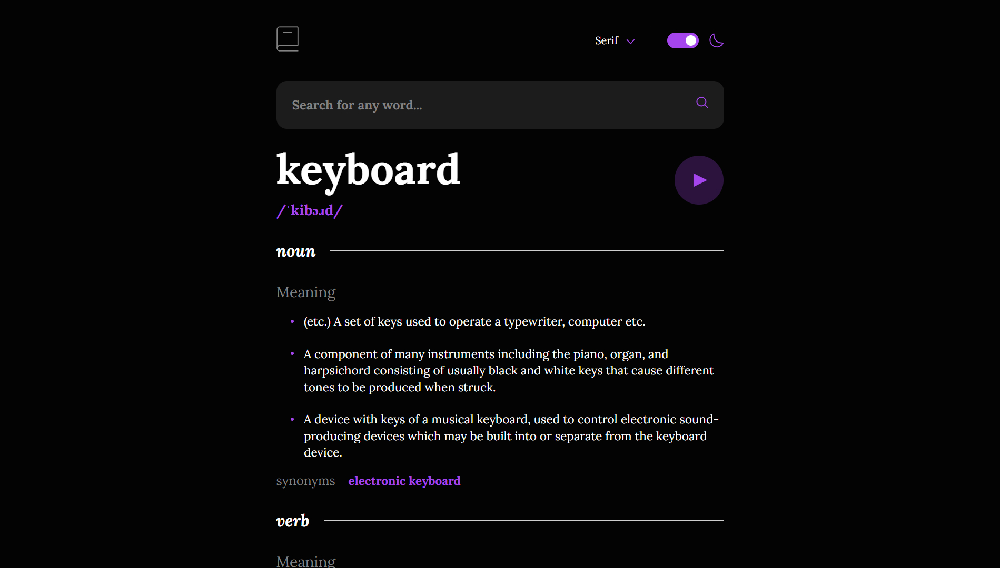
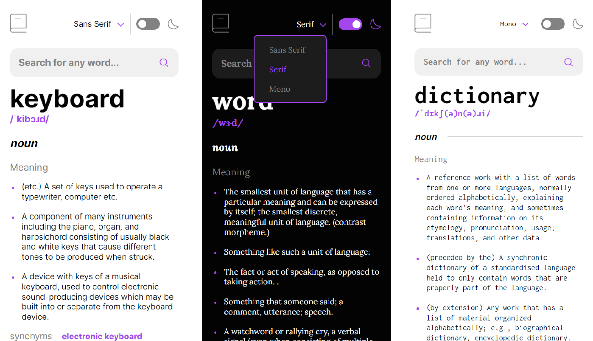

# Dictionary Web App 📘

Acesse o projeto clicando [aqui](https://filipehibrael.github.io/dictionary-web-app/)

## 📱 Layout Mobile

## 📖 Sobre

Aplicativo web de um dicionário que se conecta a uma API para buscar os significados das palavras digitadas pelo usuário. Uma validação é realizada para garantir que apenas palavras existentes sejam consultadas. Possui também funcionalidades como ouvir a pronúncia da palavra escolhida, trocar de tema e alterar a fonte utilizada no site. Projeto disponibizado pelo [Frontend mentor](https://www.frontendmentor.io/)

## 🛠️ Ferramentas Utilizadas

- HTML5
- CSS3
- SASS
- JavaScript
- [Free Dictionary API](https://dictionaryapi.dev/)